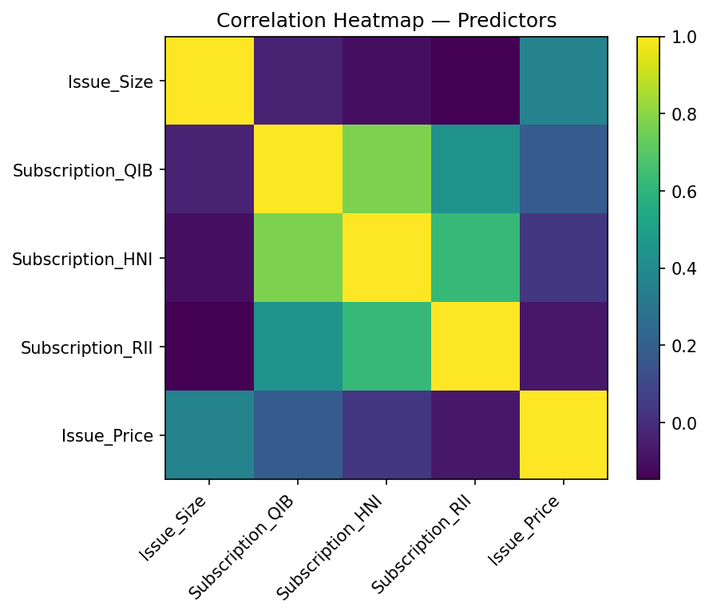

# IPO Listing Gains (India) — Full Project Report

_Generated: 2025-08-20 19:03_

## TL;DR

- Binary classification: `Listing_Gains_Profit` = 1 if listing gain > 0%, else 0.

- Predictors used: `Issue_Size, Subscription_QIB, Subscription_HNI, Subscription_RII, Issue_Price`.

- Model: Dense Neural Network (Keras Sequential) with sigmoid output.

- Scaling: Min–Max to [0,1]; Split: stratified train/test.

**Latest metrics** — Test Accuracy **0.5469**, Test AUC **0.6828**


## Key Figures

<p></p>

<p></p>

<p></p>

<p></p>

<p></p>

<p></p>


## Pipeline Overview

1. **EDA & Target** — Created `Listing_Gains_Profit` from `Listing_Gains_Percent`, checked missingness, selected features.
2. **Visualizations** — Count plot, boxplots + histograms by class, correlation heatmap.
3. **Outliers** — IQR bounds; winsorization applied to flagged features.
4. **Scaling** — Min–Max scaling of predictors to [0,1].
5. **Holdout Split** — Stratified train/test split.
6. **Model** — Dense MLP (1–4 hidden layers configurable), sigmoid output; loss=Binary CE; metrics=Accuracy/AUC.
7. **Training** — EarlyStopping (val AUC) + ReduceLROnPlateau; validation split from training.
8. **Evaluation** — Train vs Test metrics; confusion matrix + ROC.


## Step3 Visual Summary

# Step 3 — Visualization Summary

- **Class balance:** ~54.5% of IPOs listed at a profit (target=1).

- **Feature vs target (class-wise means):**
  - Issue_Size: mean(1)=1203.11, mean(0)=1180.56, Δ=22.55
  - Subscription_QIB: mean(1)=37.69, mean(0)=11.28, Δ=26.41
  - Subscription_HNI: mean(1)=105.39, mean(0)=27.73, Δ=77.66
  - Subscription_RII: mean(1)=11.75, mean(0)=4.74, Δ=7.01
  - Issue_Price: mean(1)=387.89, mean(0)=359.82, Δ=28.06

- **Strong predictor correlations (|r| ≥ 0.70):**
  - Subscription_QIB vs Subscription_HNI: r=0.77

In short: the **count plot** shows overall class balance; **boxplots** reveal potential outliers in the numeric predictors; **overlaid histograms** suggest how each predictor’s distribution differs between profit and non-profit classes; and the **correlation heatmap** highlights redundant signals you might drop before modeling.


## Step4 Outliers Summary

# Step 4 — Outlier Strategy & Rationale

We identified outliers using the **IQR rule** (lower bound = Q1 − 1.5×IQR, upper bound = Q3 + 1.5×IQR) on each numeric predictor. A variable was **selected for treatment** if either its absolute skewness exceeded **1.0** or more than **5.0%** of rows fell outside the IQR bounds.

**Variables treated (winsorized to the IQR bounds):**
- Issue_Size: skew=4.85, outliers=34 (10.7%), bounds=[-1.23e+03, 2.5e+03], values capped=34
- Subscription_QIB: skew=2.14, outliers=35 (11.0%), bounds=[-49.1, 84.9], values capped=35
- Subscription_HNI: skew=3.08, outliers=48 (15.0%), bounds=[-90, 153], values capped=48
- Subscription_RII: skew=3.71, outliers=33 (10.3%), bounds=[-9.72, 19.6], values capped=33
- Issue_Price: skew=1.70, outliers=12 (3.8%), bounds=[-506, 1.16e+03], values capped=12

The post-treatment dataset was saved to **data/ipo_clean_winsor.csv**.

**Rationale:** Winsorization preserves the rank order and reduces the influence of extreme tails on model training without discarding data. If outliers are genuine signals (e.g., very large issues or exceptional subscription spikes), keeping them bounded avoids instability while retaining their relative magnitude. If your model is tree-based, you may choose to skip winsorization; for linear/DNN models, capping can improve training stability.


## Step5 Scaling Summary

# Step 5 — Scaling Summary

- Built **y** = `Listing_Gains_Profit` and **X** = ['Issue_Size', 'Subscription_QIB', 'Subscription_HNI', 'Subscription_RII', 'Issue_Price'].

- Dropped rows with missing values in X or y prior to scaling.

- Applied **Min–Max scaling** to map each predictor to **[0, 1]**.

- Post-scaling checks (per feature): `min`≈0, `max`≈1 (minor deviations are expected if constants exist).

- Class balance after filtering: **54.5%** positive (target=1).

- Saved: `data/ipo_scaled.csv` (scaled X + y), `X.npy`, `y.npy`.


## Step6 Split Summary

# Step 6 — Holdout Split Summary
- Train proportion: **0.80** (Test: **0.20**), stratified by `Listing_Gains_Profit`.
- Shapes — Overall: `X=(319, 5)`, `y=(319,)`; Train: `X=(255, 5)`, Test: `X=(64, 5)`.
- Class balance (%% target=1) — Overall: **54.5%**, Train: **54.5%**, Test: **54.7%**.
- Number of predictor features: **5** (expected **5**).
- Artifacts saved: `data/X_train.npy`, `X_test.npy`, `y_train.npy`, `y_test.npy`, and human-readable `data/train.csv`, `data/test.csv`.


## Step7 Model Summary

# Step 7 — Model Summary
- Architecture: depth=2, units=64, activation=relu, dropout=0.2, batchnorm=False, l2=0.0
- Test loss: **0.6780**
- Test compile_metrics: **0.5469**


## Model Architecture

```
Model: "ipo_mlp"
┏━━━━━━━━━━━━━━━━━━━━━━━━━━━━━━━━━━━━━━┳━━━━━━━━━━━━━━━━━━━━━━━━━━━━━┳━━━━━━━━━━━━━━━━━┓
┃ Layer (type)                         ┃ Output Shape                ┃         Param # ┃
┡━━━━━━━━━━━━━━━━━━━━━━━━━━━━━━━━━━━━━━╇━━━━━━━━━━━━━━━━━━━━━━━━━━━━━╇━━━━━━━━━━━━━━━━━┩
│ dense_1 (Dense)                      │ (None, 64)                  │             384 │
├──────────────────────────────────────┼─────────────────────────────┼─────────────────┤
│ act_1 (Activation)                   │ (None, 64)                  │               0 │
├──────────────────────────────────────┼─────────────────────────────┼─────────────────┤
│ drop_1 (Dropout)                     │ (None, 64)                  │               0 │
├──────────────────────────────────────┼─────────────────────────────┼─────────────────┤
│ dense_2 (Dense)                      │ (None, 64)                  │           4,160 │
├──────────────────────────────────────┼─────────────────────────────┼─────────────────┤
│ act_2 (Activation)                   │ (None, 64)                  │               0 │
├──────────────────────────────────────┼─────────────────────────────┼─────────────────┤
│ drop_2 (Dropout)                     │ (None, 64)                  │               0 │
├──────────────────────────────────────┼─────────────────────────────┼─────────────────┤
│ output (Dense)                       │ (None, 1)                   │              65 │
└──────────────────────────────────────┴─────────────────────────────┴─────────────────┘
 Total params: 4,609 (18.00 KB)
 Trainable params: 4,609 (18.00 KB)
 Non-trainable params: 0 (0.00 B)

```

## Reproducibility

```bash
# create & activate venv
python -m venv .venv && source .venv/bin/activate
pip install -r requirements.txt

# (optional) place real data:
# cp <your_csv> data/Indian_IPO_Market_Data.csv

# pipeline
python ipo_step2.py
python ipo_step3_viz.py
python ipo_step4_outliers.py
python ipo_step5_scale.py
python ipo_step6_split.py
python model.py --epochs 60 --optimizer adam --lr 1e-3
python ipo_step8_evaluate.py
```
