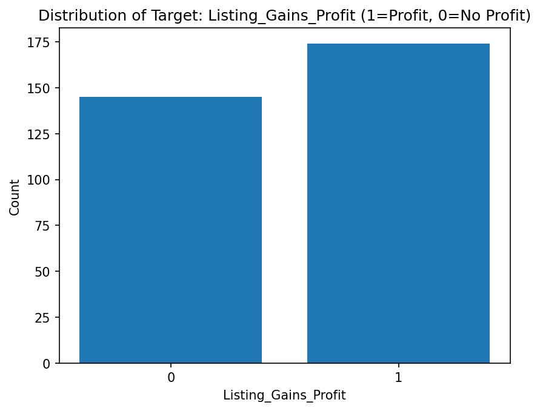
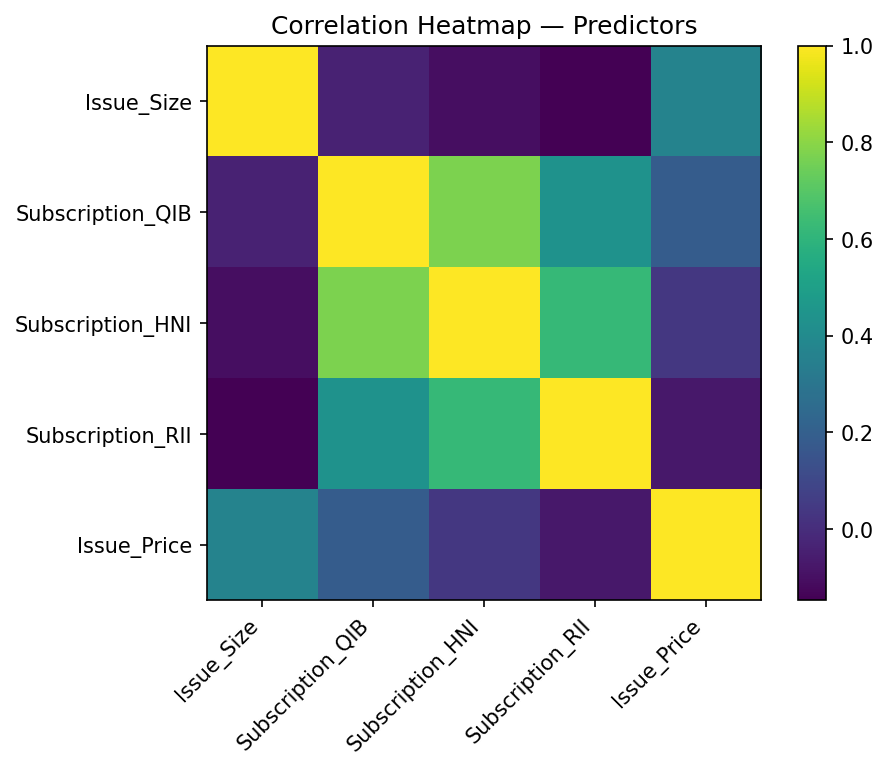
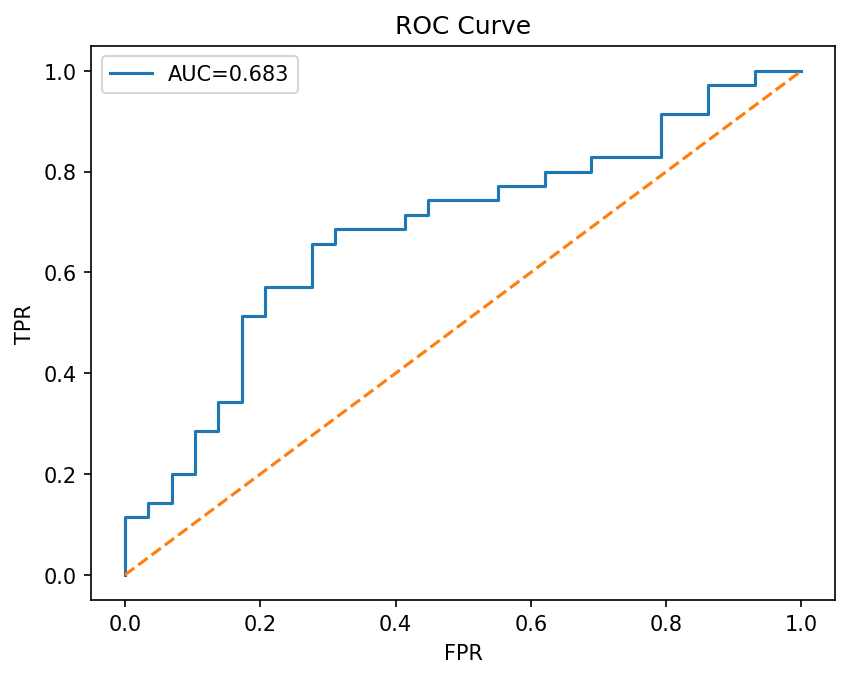
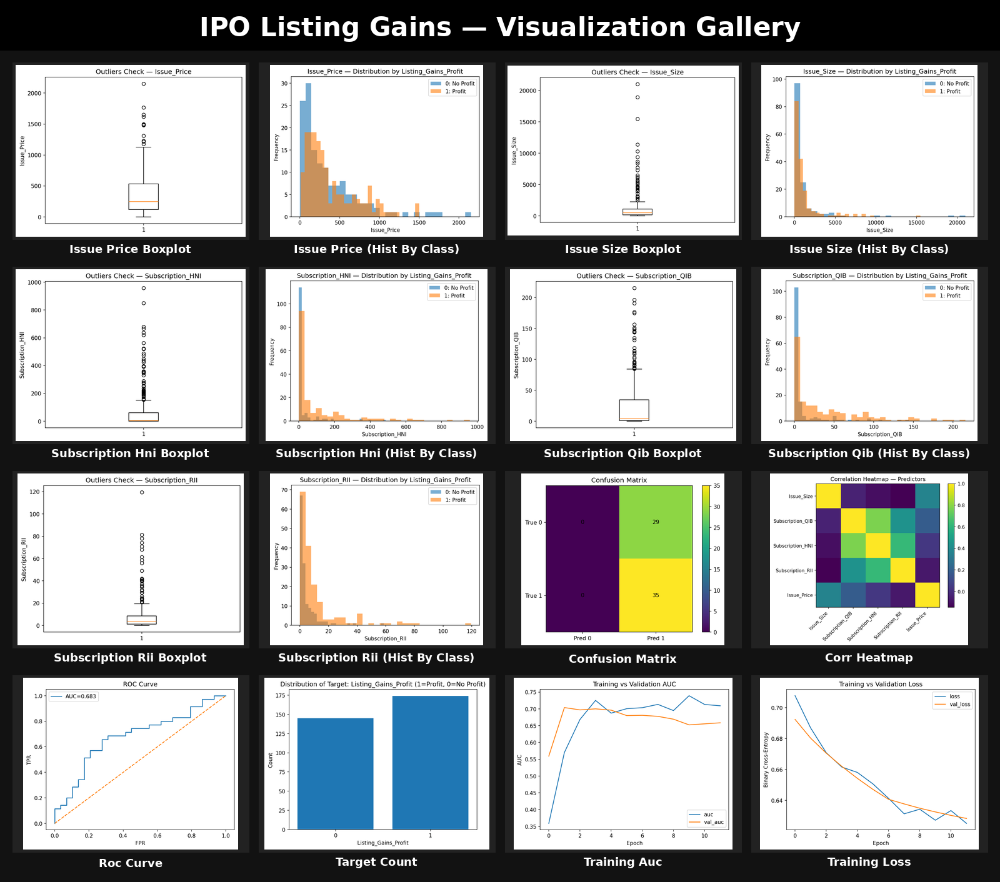

# IPO Listing Gains (India) -- TensorFlow Classifier

Predict whether an Indian IPO lists **at a profit** using a dense neural network (TensorFlow/Keras).  
End-to-end pipeline: **EDA → Viz → Cleaning/Outliers → Scaling → Split → Model → Evaluation**.

[](https://codespaces.new/Maneetss/IPO-prediction?quickstart=1)


[](LICENSE)

## 👀 Highlights
- **Target**: `Listing_Gains_Profit` (1 if listing gain > 0%)
- **Model**: Dense MLP (1-4 hidden layers, ReLU; optional Dropout/BatchNorm, L2)
- **Results (latest run)**: Test Accuracy **…** · Test AUC **…**

## 📊 Plots
<p>
  
  
  
</p>

## 🚀 Quickstart (Codespaces)
```bash
python -m venv .venv && source .venv/bin/activate
pip install -r requirements.txt
python prepdata.py          # Step 2: target/missingness/features  (your script)
python visz.py              # Step 3: visualizations               (your script)
python outliners.py         # Step 4: outliers (IQR capping)       (your script)
python scale.py             # Step 5: scale to [0,1]               (your script)
python split-train-test.py  # Step 6: stratified holdout           (your script)
python model.py --epochs 60 --optimizer adam --lr 1e-3
python evalutions.py        # Step 8: train vs test evaluation     (your script)

🗂 Structure
data/   models/   reports/
prepdata.py  visz.py  outliners.py  scale.py  split-train-test.py
model.py  evalutions.py


## 📷 Full Gallery
<p align="center">
  
</p>
